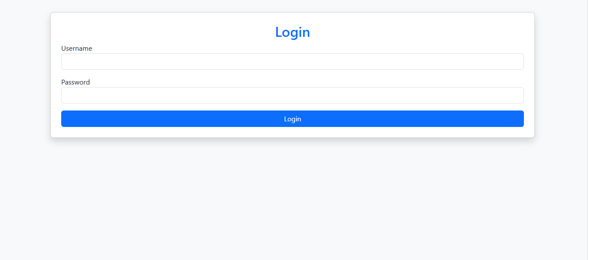
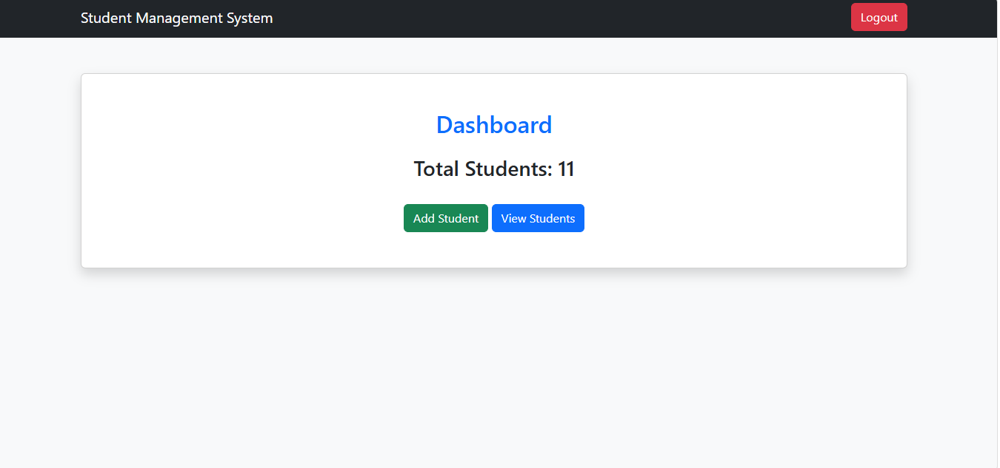
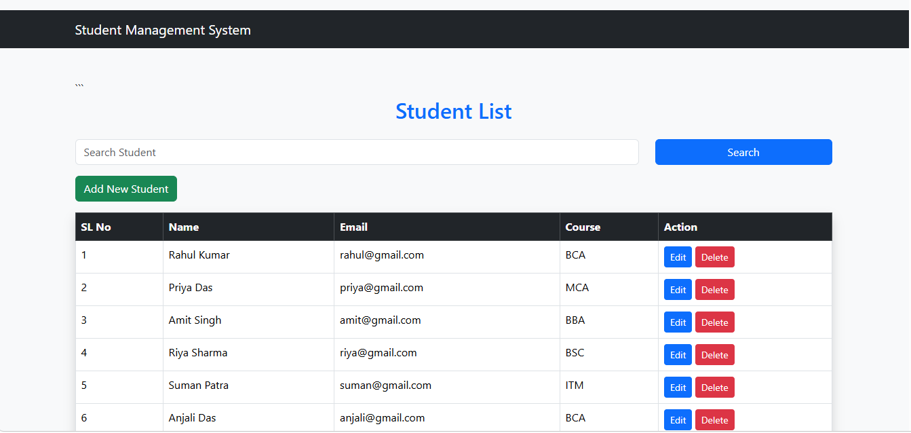

# 🎓 Student Management System

## 📖 About Project

This is a Student Management System developed using PHP, MySQL, Bootstrap, HTML, CSS, and XAMPP.

The project helps manage student records using CRUD (Create, Read, Update, Delete) operations.

---

## ✨ Features

- Admin Login
- Dashboard
- Add Student
- View Students
- Edit Student
- Delete Student
- Search Student
- Responsive Bootstrap Design

---

## 🛠 Technologies Used

- PHP
- MySQL
- HTML5
- CSS3
- Bootstrap 5
- XAMPP
- VS Code

---

## 📂 Project Files

- index.php
- login.php
- dashboard.php
- view.php
- insert.php
- update.php
- delete.php
- edit.php
- logout.php
- db.php
- student_db.sql

---

## ▶️ How to Run

1. Install XAMPP.
2. Start Apache and MySQL.
3. Copy the project folder into the htdocs folder.
4. Import the student_db.sql file into phpMyAdmin.
5. Open your browser and visit:

http://localhost/crud_project

---
## 📸 Project Screenshots

### Login Page

### Dashboard

### Add Student

### Student List

## 👩‍💻 Developed By

**Sulagna Patra**

GitHub: https://github.com/Sulagna-Patra
